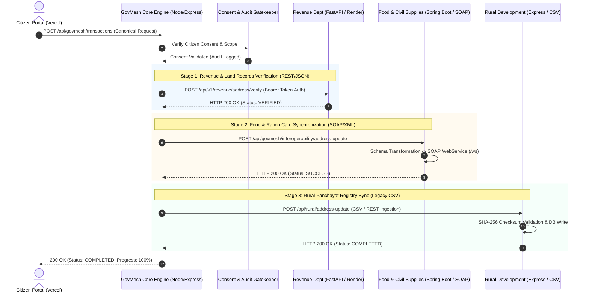

# GovMesh Core Interoperability Architecture — SIH26129

> **Disclaimer**: *This is a demonstration interoperability platform developed for SIH26129 and is not an official Government of Maharashtra production system.*

---

## 1. System Overview & Problem Context
Government departments independently develop their IT infrastructure with disparate technology stacks, data models, and protocols. In a traditional architecture, citizens must submit duplicative applications to multiple departmental portals for a single life event (e.g., updating a residential address).

**GovMesh** introduces a canonical interoperability backbone that coordinates cross-departmental service workflows while allowing individual departments to retain their legacy schemas, business rules, and protocols.

---

## 2. Target Architecture & Request/Response Lifecycle

---

## 3. Core Architectural Components

### 1. GovMesh Core Engine
*   **Canonical Transaction Model**: Decouples incoming requests from internal department structures.
*   **Service Registry**: Maintains dynamic metadata, health status, supported services, and base URLs.
*   **Consent Gatekeeper**: Ensures requests contain explicit citizen approval and enforces field-level data minimization.
*   **Deduplication & Idempotency**: Prevents repeated actions using unique `applicationId` and `correlationId`.
*   **Append-Only Audit Trail**: Captures immutable event logs without exposing sensitive citizen data.

### 2. Heterogeneous Department Adapters
*   **Revenue Adapter (REST/JSON)**: Connects to the Python FastAPI backend on Render (`https://sih-2026-revenue-dept.onrender.com`), acquiring session Bearer tokens and querying scrutiny records.
*   **Food Adapter (SOAP/XML)**: Connects to the Java Spring Boot backend, translating canonical JSON into XML payloads accepted by the department's SOAP endpoint (`/ws`).
*   **Rural Adapter (Legacy File/CSV)**: Connects to the Node.js Express backend, generating CSV batch structures with SHA-256 integrity checksum verification.
